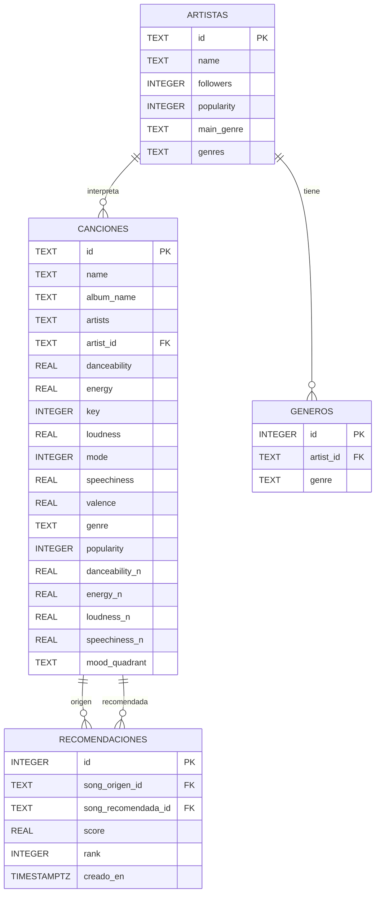

# Modelo Entidad-Relación

Responsable: Persona 1 (Datos)

Base de datos relacional del sistema (PostgreSQL), poblada por `etl/load.py` según
`database/schema.sql`. El backend (`backend/catalog.py`) reconstruye el catálogo de
trabajo con un JOIN `canciones` ⋈ `artistas`.

## Diagrama ER

## Relaciones y cardinalidades

- **ARTISTAS → CANCIONES** (1:N): un artista interpreta muchas canciones; cada canción
  tiene un artista principal (`canciones.artist_id → artistas.id`).
- **ARTISTAS → GENEROS** (1:N): un artista puede tener varios géneros. La tabla `generos`
  resuelve la relación N:M artista-género (un mismo género lo comparten muchos artistas).
- **CANCIONES → RECOMENDACIONES** (1:N, doble): cada fila de `recomendaciones` referencia
  una canción origen (la consultada) y una canción recomendada. Se puebla on-demand cuando
  la app genera un Top N.

## Notas de normalización

- Las columnas `*_n` guardan las audio features normalizadas (min-max) para el cálculo
  de similitud coseno, evitando recalcularlas en cada consulta.
- `mood_quadrant` es un atributo derivado (modelo de Russell) calculado en el ETL.
- El campo `genres` (lista) de cada artista se descompone en la tabla `generos` para
  permitir consultas relacionales por género, y se conserva también como texto en
  `artistas.genres` para que el motor de recomendación evalúe coincidencias de subgénero
  sin tener que desnormalizar la tabla `generos` en cada consulta.
- `canciones.artists` guarda la lista de colaboradores (texto) solo para mostrarla en la
  UI; el artista principal usado por el motor y el JOIN es `canciones.artist_id`.
